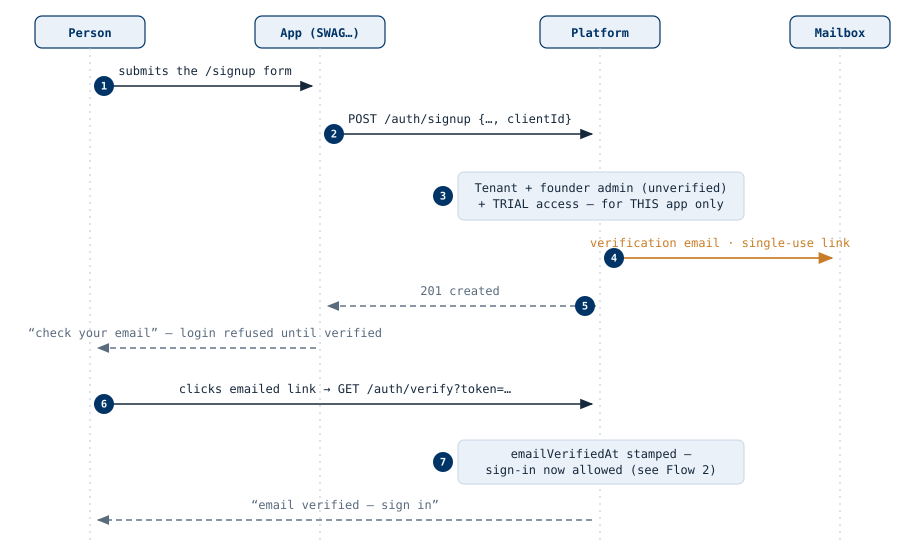
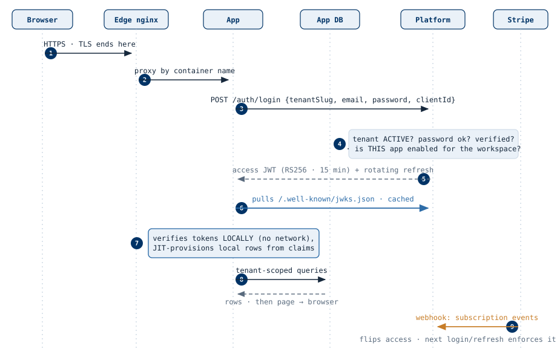
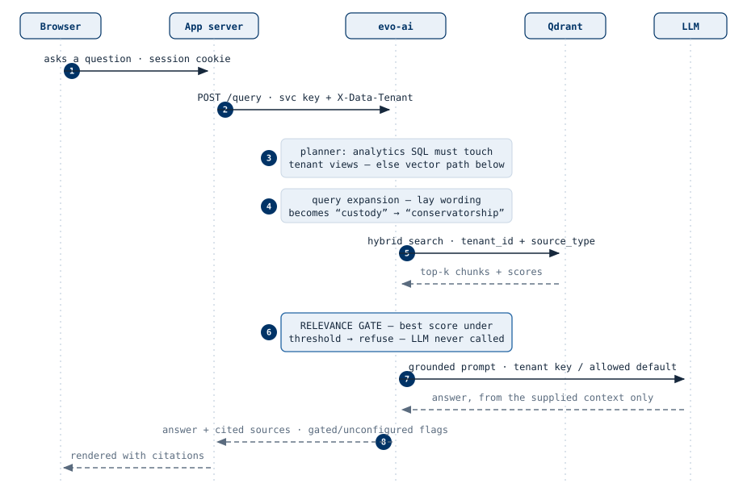

# EvoPlatform


A multi-tenant SaaS platform and app-template toolkit. Build a new tenant-aware site by
cloning a starter template — tenancy, auth, RBAC, audit logging, and deployment come wired in.

> **Status: working v1.** The platform service (with admin console), both SDKs (Node and
> Python), the Next.js template, and the `evo new` CLI all run and are tested, and are in
> production under three apps: ProvenSheet, CivilCode, and DocketMail. **Setup: [docs/INSTALL.md](docs/INSTALL.md)** · deploy:
> [docs/DEPLOY.md](docs/DEPLOY.md) · design:
> [docs/ARCHITECTURE.md](docs/ARCHITECTURE.md), [docs/TEMPLATE_CONTRACT.md](docs/TEMPLATE_CONTRACT.md) · flows:
> [docs/FLOWS.md](docs/FLOWS.md).

## The idea

Most multi-tenant apps re-implement the same undifferentiated plumbing: tenant isolation,
login, roles, billing, email, admin tooling. EvoPlatform splits that into:

- **A shared platform service** (Node.js/NestJS + Prisma + PostgreSQL) that owns tenants,
  users, auth (JWT/JWKS), billing, and SMTP — one service serving many apps.
- **Two SDKs** — `@evoplatform/sdk-node` and `evoplatform-sdk` (Python) — wrapping auth,
  tenancy, members, invites, billing, brand and email, so apps talk to the platform without
  hand-rolling HTTP calls.
- **A starter template** conforming to a single template contract:
  `templates/next` — Next.js + Prisma + PostgreSQL, with an offline-first browser layer
  (IndexedDB mutation queue, last-write-wins sync).
- **A scaffold CLI** — `evo new <app-name>` — clone, rename, generate secrets, done.

## Standalone mode

Every template runs **without** the platform service by default: a local users table, a
single implicit tenant, and no external dependencies — the whole app runs on one machine,
offline if needed. Setting `PLATFORM_URL` (plus client credentials) flips auth, tenancy, and
email over to the platform SDK. Apps can start standalone today and join the platform later.

## System flows

How requests move through the platform — the full walkthrough with numbered
steps and direction rules is in [docs/FLOWS.md](docs/FLOWS.md). Solid arrows
are requests (tail = initiator), dashed are responses, amber is an out-of-band
push, blue is the mechanism each figure exists to show.

**User sign-up, end to end** — one request creates the workspace, its founding
admin, and trial access to the arriving app only; nobody signs in until the
mailbox is verified:



**A tenant site through the system** — login is delegated to the platform,
then every request is verified locally against pulled JWKS keys; after login
the app does not need the platform to be up:



**A tenant app asking evo-ai** (separate, commercial service; the SDK's
`AskAi` client is optional) — server-side service key, tenant-scoped
retrieval, and a relevance gate that refuses before any model is invoked:



## Repository layout

```
platform/            Shared platform service (NestJS)
packages/sdk-node/   Node SDK
packages/sdk-python/ Python SDK
templates/next/      Next.js starter template
cli/                 `evo new` scaffolding tool
docs/                Architecture and design docs
```

## License

[MIT](LICENSE) © Kelly Michels
