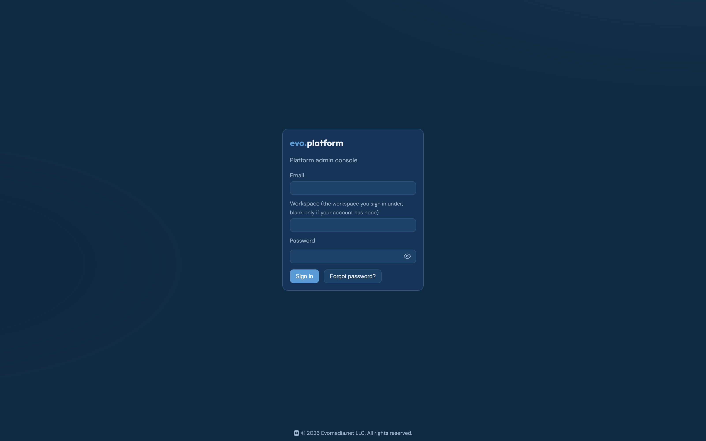
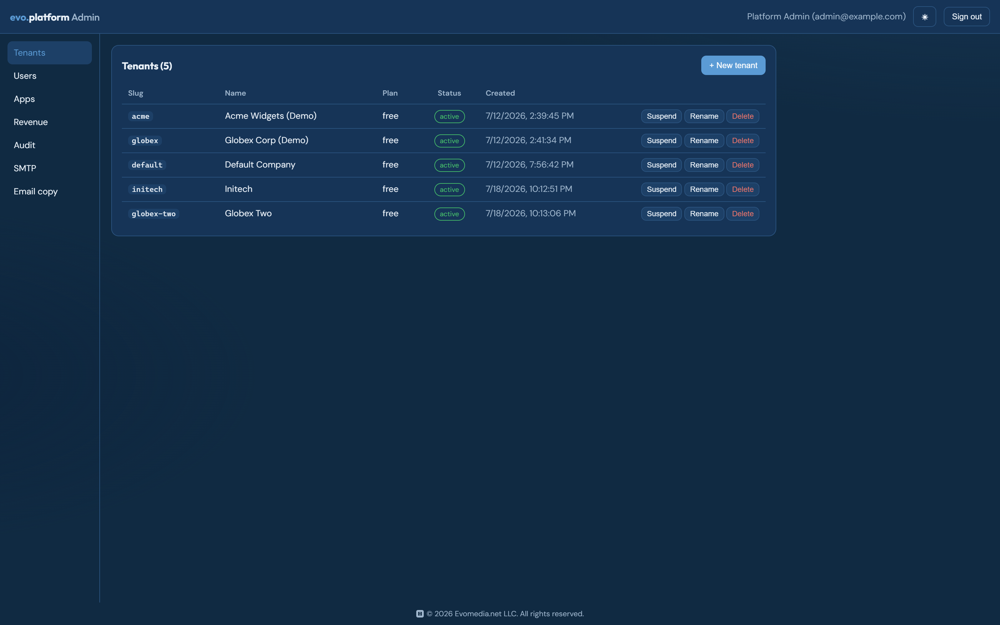
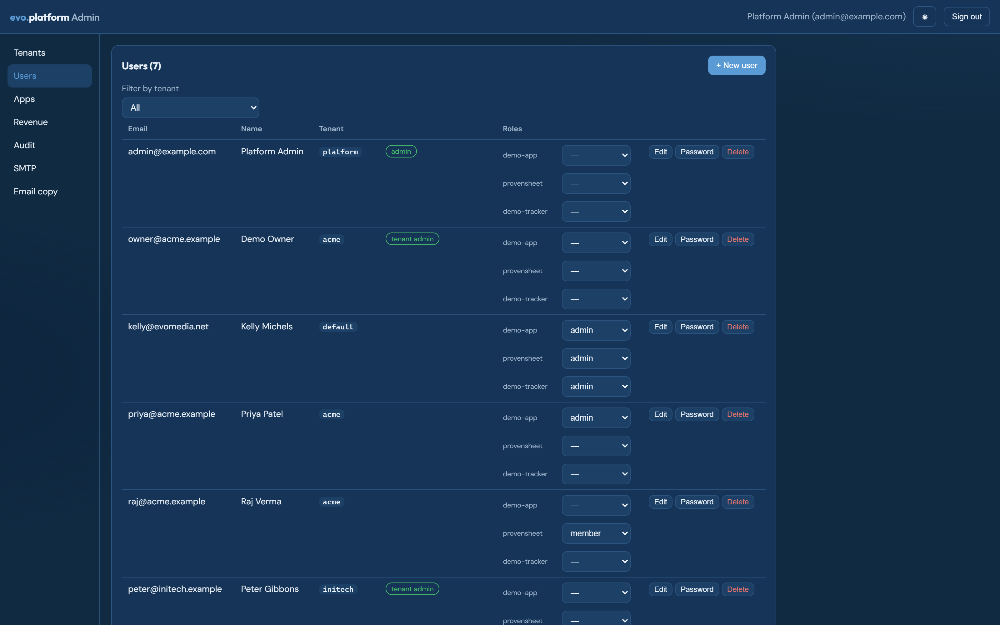
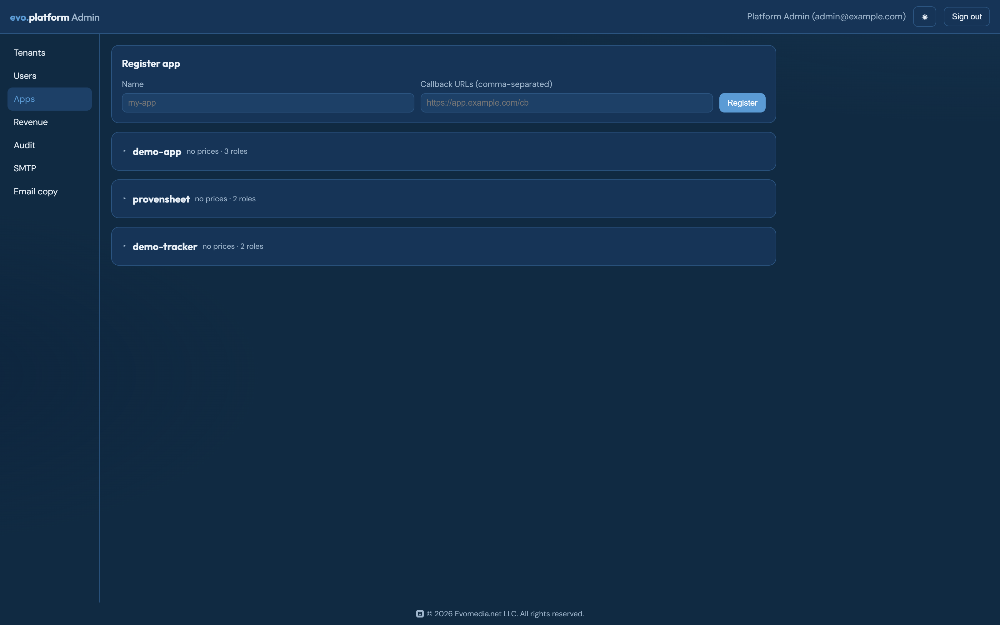
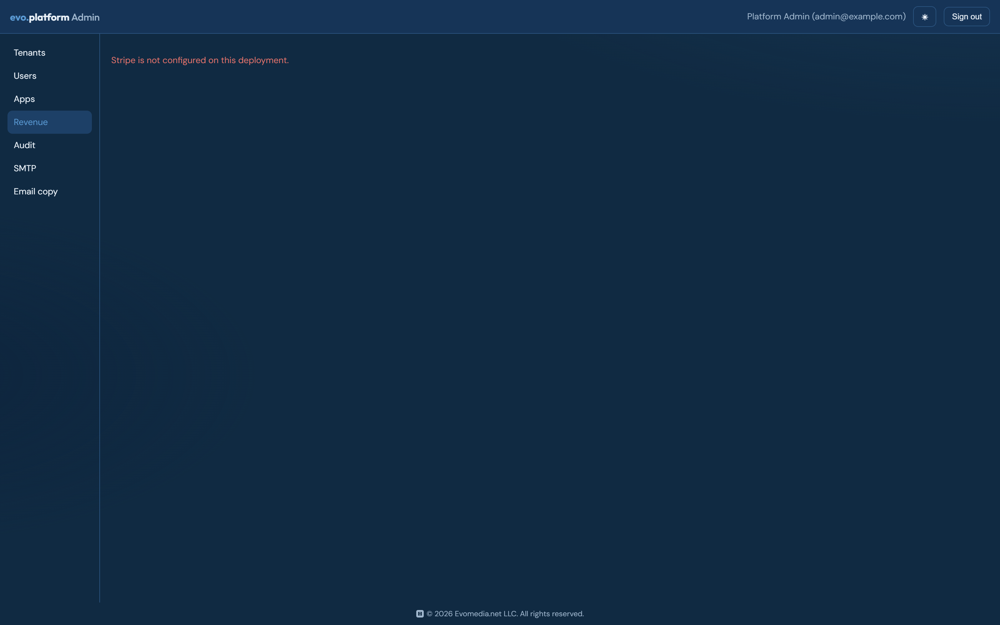
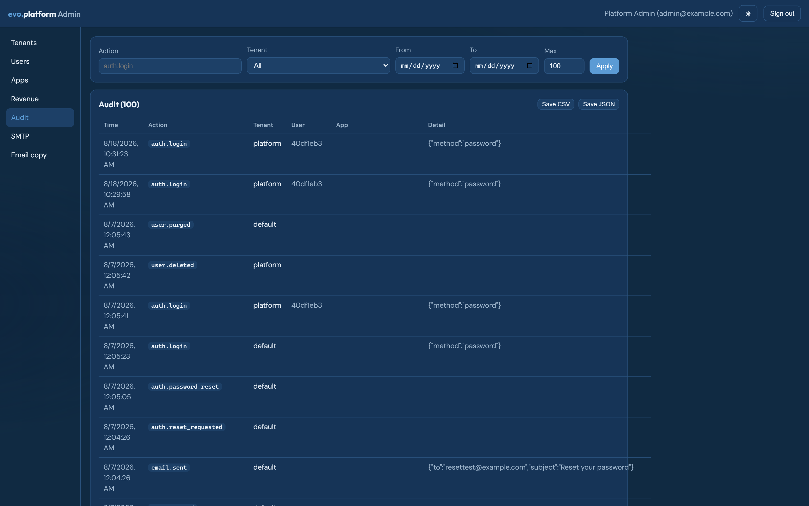
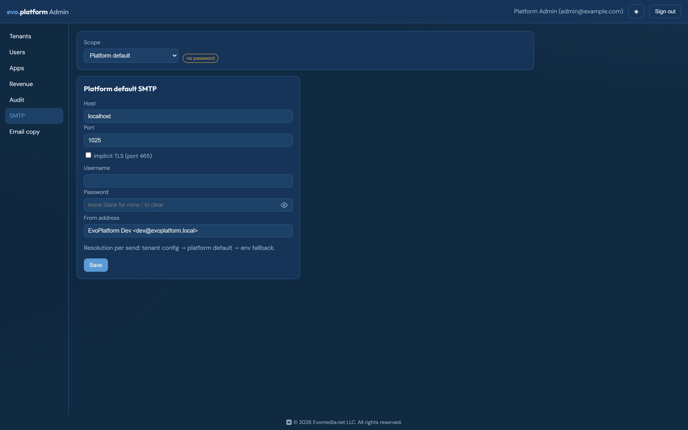
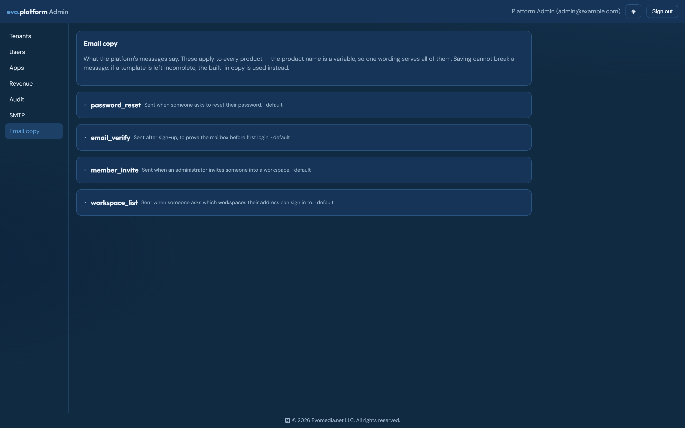

# The admin console

The platform ships its own operator console at the service root. It is plain
JavaScript with no build step — one `admin-ui.js`, one stylesheet — so it works
on a box with no outbound internet and cannot drift from a bundler config.

Seven sections, in nav order. Every screenshot below is captured from a local
instance with demo data by
[`platform/scripts/capture_console_shots.py`](../platform/scripts/capture_console_shots.py);
regenerate them the same way rather than by hand.

## Sign in

Email, an optional workspace, and a password. The workspace is blank for a
platform-level account and required for a tenant user — the field says so,
because "invalid credentials" against the right password and the wrong
workspace is the single most confusing failure this form has.

## Tenants

Workspaces, their plan and status. Suspend is reversible and stops sign-in
immediately; delete is a soft delete that keeps the slug reserved, so a new
workspace cannot silently inherit a retired one's name.

## Users

Platform admins and tenant members in one list, filterable by workspace. Roles
are per app, which is why each row carries a selector per registered app rather
than a single global role.

## Apps

The registry: client id, secret rotation, display name, brand config, callback
URLs, roles and price tiers, per app.

Two fields here decide what customers see. **Display name** is what recovery
email is titled with — a slug in a password-reset subject undermines the
legitimacy the message needs. **Brand config** is the JSON record an app fetches
at startup and merges over the `brand.json` it ships, so a rename moves the
product's strings without a deploy.

Callback URLs are load-bearing beyond OAuth: billing checkout and portal returns
must share an origin with one of them, so an app with none registered cannot
start a checkout.

## Revenue

Subscription totals and health, with a CSV export. Empty on a local instance —
the figures come from Stripe, and a dev database has no billing history.

## Audit

Auth and administrative events, filterable by action, workspace and date, with
CSV and JSON export. Apps push their own events here through the SDK, so an
operator sees platform and application activity in one timeline.

## SMTP

Mail configuration. A workspace with no config of its own inherits the
platform's, and the console shows which one a send will actually use — a silent
fallback and a silent failure look identical from an operator's chair.

## Email copy

The wording of every message the platform sends. The product name is a variable,
so one set of copy serves every app rather than drifting into a per-product
template set.

Saving cannot break recovery: an incomplete template falls back to the built-in
default and logs, because locking someone out of a password reset over a
fat-fingered template would be far worse than sending them stock wording.
